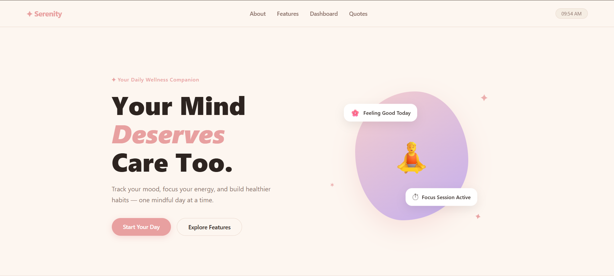
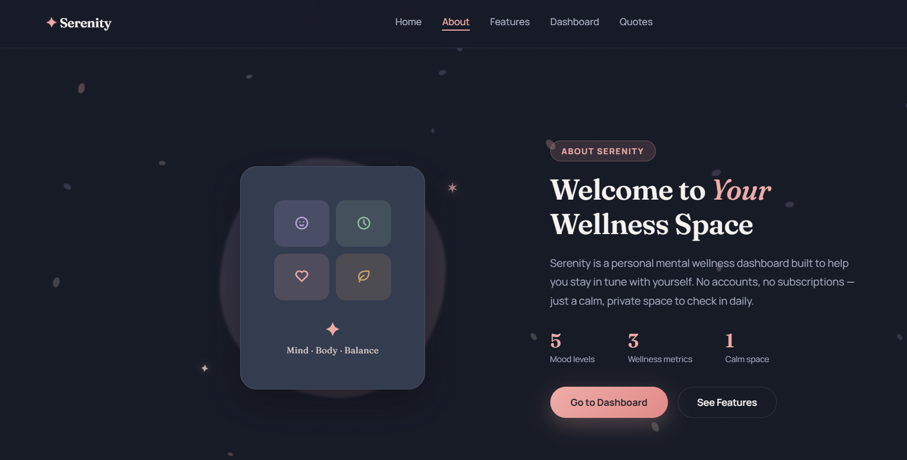

<div align="center">


<br>


</div>

<br>

---

## 🌙 Section 1 — Overview

### Serenity — Mental Wellness Dashboard

> *"You don't have to control your thoughts. You just have to stop letting them control you."*

### 📖 Description &nbsp;·&nbsp; Why This Exists

Serenity is a personal, offline-first mental wellness dashboard — a calm corner of the internet with no logins, no subscriptions, and no data leaving your browser. It was built out of a simple frustration: most wellness apps are either overloaded with features or locked behind a paywall for basics like mood tracking and a Pomodoro timer.

Serenity strips that down to what actually matters day-to-day — logging how you feel, focusing for a session, checking in on hydration/sleep/movement, and closing loops on small tasks — wrapped in a moody, floral-dark aesthetic that feels more like a quiet ritual than another dashboard.

### 🧵 Experience &nbsp;·&nbsp; The Build Journey

This project went through a full visual identity shift — from an early bright/pastel layout to a deliberate **"Dried Bloom" dark theme** (ink navy, dusty rose, warm taupe, soft cream) designed around a moodboard rather than default UI-kit colors. Along the way it evolved from a single-file build into a proper multi-page structure, and picked up its animation layer — scroll reveals, an SVG focus-ring timer, ambient floating particles, and micro-interactions on every card and button — on top of the original vanilla logic.

### ✅ Requisites

No installs, no build step, no dependencies to manage:

- A modern browser (Chrome, Edge, Firefox, Safari — anything from the last few years)
- Internet connection on first load (for Google Fonts + Tabler Icons via CDN)
- That's it — everything else runs client-side in plain HTML/CSS/JS

<br>

---

## 🗂️ Section 2 — Project Details

### 🎯 Project Context

Serenity is a solo front-end project focused on **mood tracking, focus management, and daily wellness check-ins**, built as a portfolio piece to demonstrate interaction design, animation, and clean vanilla JS state handling without relying on a framework.

### ⚙️ Installation

```bash
# 1. Clone the repository
git clone https://github.com/SAMYUKTHASRR/Serenity-Mental-Wellness-Dashboard.git

# 2. Move into the project folder
cd Serenity-Mental-Wellness-Dashboard

# 3. Open it — no build tools required
open index.html
# or just double-click index.html / drag it into your browser
```

Prefer a local dev server (recommended for the multi-page version so relative links behave):

```bash
# using VS Code Live Server extension, or:
npx serve .
```

### 🛠️ Tech Stack

| Layer        | Tools |
|--------------|-------|
| Markup       | HTML5 (semantic sections) |
| Styling      | CSS3 — custom properties, `IntersectionObserver`-driven reveals, SVG-based progress rings |
| Behavior     | Vanilla JavaScript (ES6+), no frameworks |
| Typography   | [Fraunces](https://fonts.google.com/specimen/Fraunces) (display) + [Manrope](https://fonts.google.com/specimen/Manrope) (body) via Google Fonts |
| Icons        | [Tabler Icons](https://tabler.io/icons) |
| Hosting      | GitHub Pages |

### 🙏 Credits &nbsp;/&nbsp; Acknowledgment

- Quotes curated from various mindfulness and self-help sources — full credit to their original authors (attributed inline in the app).
- Color palette inspired by a dark floral moodboard (dusty rose, ink navy, warm taupe, soft cream).
- Icons by [Tabler Icons](https://tabler.io/icons); fonts by [Google Fonts](https://fonts.google.com).
- Built and designed by **[Samyuktha Sanil](https://github.com/SAMYUKTHASRR)**.

<br>

---

## 📌 Section 3 — Reference

### 📑 Table of Contents

- [Overview](#-section-1--overview)
  - [Description](#-description--why-this-exists)
  - [Experience](#-experience--the-build-journey)
  - [Requisites](#-requisites)
- [Project Details](#️-section-2--project-details)
  - [Project Context](#-project-context)
  - [Installation](#️-installation)
  - [Tech Stack](#️-tech-stack)
  - [Credits](#-credits--acknowledgment)
- [Reference](#-section-3--reference)
  - [Visuals](#️-visuals)
  - [Running Tests](#-running-tests)
  - [Project Status](#-project-status)

### 🖼️ Visuals

<div align="center">

| Home | About |
|:---:|:---:|
|  |  |

| Features | Dashboard |
|:---:|:---:|
|  |  |

</div>

> Drop `about.png`, `feature.png`, and `dashboard.png` into the repo root (or an `/assets` folder — just update the paths above to match, e.g. `assets/about.png`) alongside the existing `preview.png`.

### 🧪 Running Tests

Serenity is a static front-end project with no test suite or backend — verification is manual:

1. Open each page (`index.html`, `about.html`, `features.html`, `dashboard.html`, `quotes.html`) and confirm nav links route correctly.
2. On **Dashboard**: log a mood, start/pause the focus timer, add and complete a task, and enter hydration/sleep/movement values — confirm the UI updates live.
3. On **Quotes**: click "New Quote" a few times to confirm no immediate repeats.
4. Resize to mobile width and confirm the hamburger nav opens/closes correctly.

> If you'd like automated coverage later, this project is a good candidate for [Playwright](https://playwright.dev/) UI smoke tests, since all interactions are DOM-based with no backend to mock.

### 🚦 Project Status


Actively maintained — currently in the middle of a visual + structural redesign (multi-page split, new "Dried Bloom" theme, animation layer). Next up: persisting state with `localStorage`, and a possible React rebuild.

<br>

<div align="center">

</div>